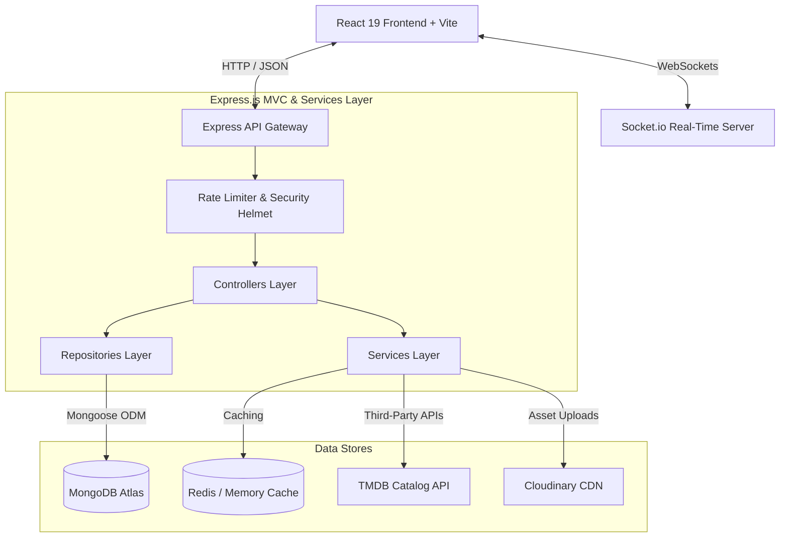
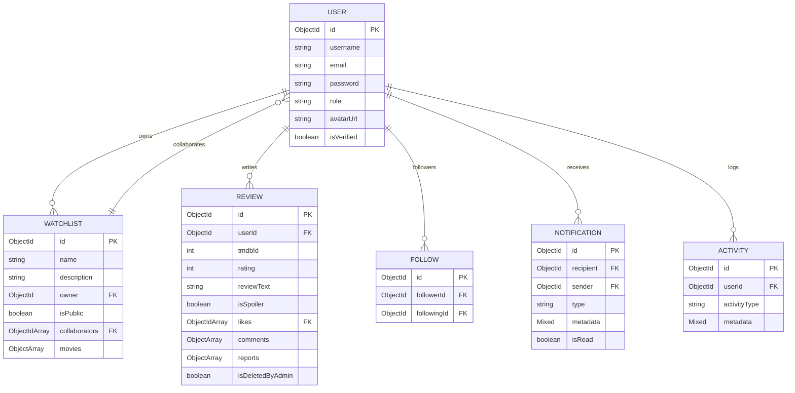

# FlixKeep 🎬

FlixKeep is a production-grade, full-stack social watchlist platform engineered for movie enthusiasts. Users can explore trending and upcoming releases, curate personalized watchlists, invite collaborators for real-time list editing, write reviews with spoiler filters, follow other film buffs, view detailed data analytics, and receive instant socket-driven notifications.

---

## 🏗️ System Architecture

The project is structured as a modular Monorepo following the **Model-View-Controller (MVC)** design pattern, backed by a service layer and database repositories.



---

## 🗄️ Database ER Diagram

The database structure features indexing, unique compound constraints, and document relationships:



---

## 🛠️ Technology Stack

| Component | Technology | Description |
|---|---|---|
| **Frontend** | React 19, Vite, Bootstrap 5 | Component-based, responsive UI styling |
| **State & API** | React Query, Axios, React Hook Form | Query caching, form validations, API calls |
| **Real-time** | Socket.io-client | Real-time WebSocket connection channels |
| **Backend** | Node.js, Express.js (MVC) | Lightweight REST architecture |
| **Database** | MongoDB Atlas, Mongoose ODM | Document-oriented, fast indexing |
| **Caching** | Redis (Fallback: In-Memory) | TMDB API response cache |
| **Security** | Helmet, rate-limit, mongo-sanitize | XSS protection, anti-brute force, injection prevention |
| **Testing** | Jest, Supertest | Unit & REST integration test runners |

---

## 🚀 Setup & Installation

### Prerequisites
- Node.js (v18+)
- MongoDB (Local or MongoDB Atlas cluster)
- Redis server (optional, service defaults to memory cache if inactive)

### 1. Clone & Install Dependencies
```bash
# Install backend packages
cd backend
npm install

# Install frontend packages
cd ../frontend
npm install
```

### 2. Configure Environment Variables
Create a `.env` file in the `backend/` directory:
```env
PORT=5000
NODE_ENV=development
MONGODB_URI=mongodb://localhost:27017/flixkeep
REDIS_URL=redis://localhost:6379
JWT_SECRET=your_jwt_secret_key
JWT_REFRESH_SECRET=your_refresh_token_secret_key
JWT_EXPIRE=15m
JWT_REFRESH_EXPIRE=7d

TMDB_API_KEY=your_tmdb_v3_api_key

CLOUDINARY_CLOUD_NAME=your_cloud_name
CLOUDINARY_API_KEY=your_api_key
CLOUDINARY_API_SECRET=your_api_secret

EMAIL_HOST=smtp.mailtrap.io
EMAIL_PORT=2525
EMAIL_USER=your_smtp_username
EMAIL_PASS=your_smtp_password
EMAIL_FROM=noreply@flixkeep.com
```

### 3. Run the Servers
```bash
# Run backend development server (from backend directory)
npm run dev

# Run frontend development server (from frontend directory)
npm run dev
```

---

## 📡 REST API Reference

### 🔐 Authentication
- `POST /api/v1/auth/register` — Register a new account
- `POST /api/v1/auth/login` — Login & issue JWT tokens
- `POST /api/v1/auth/refresh` — Refresh access tokens
- `POST /api/v1/auth/logout` — Revoke session keys
- `GET /api/v1/auth/me` — Retrieve active user details

### 🎬 Movie Catalog
- `GET /api/v1/movies/trending` — List trending movies
- `GET /api/v1/movies/upcoming` — Get upcoming releases schedule
- `GET /api/v1/movies/search` — Query catalog with tags & filter parameters
- `GET /api/v1/movies/suggestions` — Live debounced suggestions
- `GET /api/v1/movies/:id` — Inspect detailed profiles & credits

### 📋 Watchlists
- `GET /api/v1/watchlists` — List active user watchlists
- `POST /api/v1/watchlists` — Create a new watchlist
- `GET /api/v1/watchlists/:id` — Fetch details & collaborative permissions
- `POST /api/v1/watchlists/:id/movies` — Insert movie to list
- `DELETE /api/v1/watchlists/:id/movies/:tmdbId` — Remove movie
- `PUT /api/v1/watchlists/:id/reorder` — Reorder movies index order

### 🔔 Notifications
- `GET /api/v1/notifications` — Fetch user alerts feed
- `GET /api/v1/notifications/unread` — Count unread items badge
- `PUT /api/v1/notifications/:id` — Mark single alert as read
- `PUT /api/v1/notifications/mark-all` — Batch mark all alerts read
